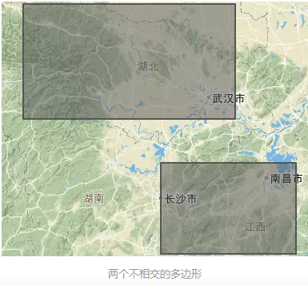
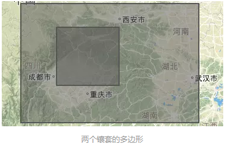
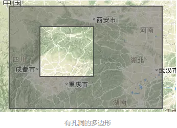

##geojson结构
* 一个点的数据表示  

```javascript
{
  "type": "FeatureCollection",
  "features": [
        {"type":"Feature",
        "properties":{},
        "geometry":{
            "type":"Point",
            "coordinates":[105.380859375,31.57853542647338]
            }
        }
    ]
}
```
  
&emsp;geojson 将所有的地理要素分为 <font color=red size=4><b>*Point、MultiPoint、LineString、MultiLineString、Polygon、MultiPolygon、GeometryCollection*</b></font>。首先是将这些要素封装到单个的geometry里，然后作为一个个的Feature（也就是要素）；要素放到一个要素集合里，从树状结构来理解FeatureCollection就是根节点，表示为：
```javascript
{
  "type": "FeatureCollection",
  "features": []
}
```
* **点要素Point**
&nbsp;&nbsp;&nbsp;&nbsp;点要素是最简单的，类型type对应Point，然后坐标是一个1维的数组，里面有两个元素（如果是立体的坐标就是三维x,y,z），分别为经度和纬度。***properties里面可以封装各种属性，例如名称、标识颜色等等***

```javascript
{"type":"Feature",
    "properties":{},
    "geometry":{
        "type":"Point",
        "coordinates":[105.380859375,31.57853542647338]
        }
    }
```
* **多点要素MultiPoint**
```javascript
{"type":"Feature",
    "properties":{},
    "geometry":{
        "type":"MultiPoint",
        "coordinates":[[105.380859375,31.57853542647338],
                [105.580859375,31.52853542647338]
            ]
        }
        }
```

* **线要素LineString**
&emsp;线要素就是指线段，记录的是线的端点坐标，可视化时会按照记录顺序联结。对于曲线（如贝塞尔曲线）目前还没有很好的表达，但是在地理数据中，曲线一般会用LineString去拟合，现实地理世界中也没有标准的曲线地理要素。

&emsp;&emsp;<font color=red size=5>线要素、多点要素geometry区别，tpye不同、coordinates相同</font>
```javascript
{"type":"Feature",
    "properties":{},
    "geometry":{
        "type":"LineString",
        "coordinates":[[105.6005859375,30.65681556429287],
        [107.95166015624999,31.98944183792288],
        [109.3798828125,30.031055426540206],
        [107.7978515625,29.935895213372444]]
        }
    }
````

* **MultiLineString**

```javascript
{"type":"Feature",
    "properties":{},
    "geometry":{
        "type":"MultiLineString",
        "coordinates":
        [
            [
                [105.6005859375,30.65681556429287],
                [107.95166015624999,31.98944183792288],
                [109.3798828125,30.031055426540206],
                [107.7978515625,29.935895213372444]
            ],
            [
                [109.3798828125,30.031055426540206],
                [107.1978515625,31.235895213372444]
            ]
        ]
                }
    }
```
&emsp;***tip:*** (**MultiLineString / Polygon**) coordinates 均是三维数组、仅type不同

* **多边形Polygon**

```javascript
{"type":"Feature",
    "properties":{},
    "geometry":{
        "type":"Polygon",
        "coordinates":[
                        [
                          [106.10595703125,33.33970700424026],
                          [106.32568359375,32.41706632846282],
                          [108.03955078125,32.2313896627376],
                          [108.25927734375,33.15594830078649],
                          [106.10595703125,33.33970700424026]
                        ]
                      ]
        }
    }
```
&emsp;***tip:*** coordinates数组中，第一个经纬度坐标和最后一个经纬度坐标相同，从而构成一个闭合的多边形

* **多多边形MultiPolygon**
    - type1&emsp;两个不会相交的多边形
    
    ```javascript
    {
  "type": "Feature",
  "properties": {},
  "geometry": {
  "type": "MultiPolygon",
  "coordinates":
    [ 
        [
            [
                [109.2041015625,30.088107753367257],
                [115.02685546875,30.088107753367257],
                [115.02685546875,32.7872745269555],
                [109.2041015625,32.7872745269555],
                [109.2041015625,30.088107753367257]
          
          
            ]
        ],
        [
            [
                [112.9833984375,26.82407078047018],
                [116.69677734375,26.82407078047018],
                [116.69677734375,29.036960648558267],
                [112.9833984375,29.036960648558267],
                [112.9833984375,26.82407078047018]
            ]
        ]
    ]
             }
    }
    ```
    - type2&emsp;两个嵌套的多边形
    
    ***tip:*** &emsp;**小的框经纬度在前，范围大的在后面**
    ```javascript
    {
      "type": "Feature",
      "properties": {},
      "geometry": {
        "type": "MultiPolygon",
        "coordinates":
        [ 
            [
                [
                    [101.6455078125,27.68352808378776],
                    [114.78515624999999,27.68352808378776],
                    [114.78515624999999,35.209721645221386],
                    [101.6455078125,35.209721645221386],
                    [101.6455078125,27.68352808378776]
                ]   
            ],
            [
                [
                    [104.2822265625,30.107117887092357],
                    [108.896484375,30.107117887092357],
                    [108.896484375,33.76088200086917],
                    [104.2822265625,33.76088200086917],
                    [104.2822265625,30.107117887092357]
                ]
            ]
        ]
      }
    }
    ````
    - type3 &emsp;有孔的多边形
    
    ```javascript
    {
      "type": "Feature",
      "properties": {},
      "geometry": {
        "type": "MultiPolygon",
        "coordinates":
    [ 
        [
            [
                [101.6455078125,27.68352808378776],
                [114.78515624999999,27.68352808378776],
                [114.78515624999999,35.209721645221386],
                [101.6455078125,35.209721645221386],
                [101.6455078125,27.68352808378776]
                
          
            ],
            [
                [104.2822265625,30.107117887092357],
                [108.896484375,30.107117887092357],
                [108.896484375,33.76088200086917],
                [104.2822265625,33.76088200086917],
                [104.2822265625,30.107117887092357]
            
            ]
        ]
    ]
                }
    }
    ```
    <font color=red size=4><b>注： coordinates两个边框数组的关系 区别是有孔还是嵌套</b></font>

* **GeometryCollection**
&emsp;&emsp;GeometryCollection是多种基本地理要素的集合，就是里面可以包含点、线、面要素。
```javascript
{
    "type": "GeometryCollection",
    "geometries": [
        {
         "type": "Point",
          "coordinates": [108.62, 31.02819]
         }, {
         "type": "LineString",
          "coordinates": [[108.896484375,30.1071178870],
          [108.2184375,30.91717870],
          [109.5184375,31.2175780]]
         }]
}
```
***tip:*** &emsp;GeometryCollection不需要放在FeatureCollection里：
```javascript
{
  "type": "FeatureCollection",
  "features": []
}
```
&emsp;&emsp;geojson里面还有其他标签表达其他的属性，如外包矩形等，其中特别重要的是坐标系统，一般里面的坐标默认为WGS84，当然也可以是其他坐标系统的坐标，但是要标识。