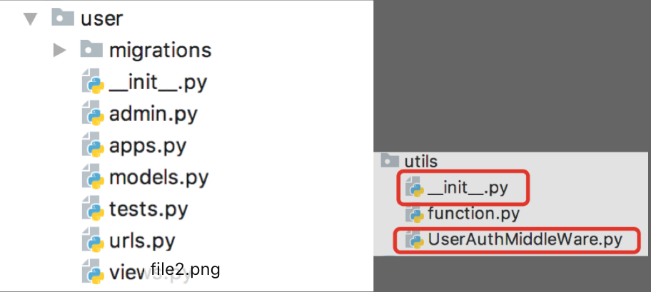

>作者:李忠林
>
>Github: https://github.com/Leezhonglin
>
>日期: 2018年6月5日

##### django中注册登录实现

###### 自定义中间件

​	其实说django自己也带了中间件,但是用起来有点不灵活,需要验证的每个url前面需要包一层login_required(),自我感觉有点不方便.说干就干吧.

首先在我们的项目文件夹下面创建一个新的目录专门用来存放我们中间件和其他函数.文件夹的名字我们就命名为:utils.在使用python manage.py startapp user 建立好我们用户的应用,所有与用户相关的东西都放这里面来.




文件中的UserAuthMiddleware.py就是我们要自定义中间件的文件.init文件就是我们要去初始化中间件.

下面我们就在UserAuthMiddleware.py中开始写我们的代码了.

```python
from datetime import datetime

from django.db.models import Q
from django.http import HttpResponseRedirect
from django.core.urlresolvers import reverse
from django.utils.deprecation import MiddlewareMixin

from user.models import UserTicketModel


class UserAuthMiddle(MiddlewareMixin):

    def process_request(self, request):
        # 验证cookie中的ticket,验证不通过,跳转到登录页面
        # 验证通过,request.user 就能获取当前登录的用户信息
        # path = request.path
        # 需要登录验证, 个人中心和购物车
        need_login = ['/axf/mine/', '/axf/cart/']

        if request.path in need_login:
            # 先获取cookie中的ticket的参数
            ticket = request.COOKIES.get('ticket')
            # 如果没有ticket 直接跳转到登录
            if not ticket:
                return HttpResponseRedirect(reverse('user:login'))
            # 查询ticket对应的用户
            user_ticket = UserTicketModel.objects.filter(ticket=ticket).first()
            if user_ticket:
                # 获取到有认证的相关信息
                # 1. 验证当前认证信息是否过期,如果没有过期,request.user赋值
                # 2. 如果过期了,跳转到登录,并删除认证信息
                # --------------------------------- #
                # 判断当期时间是否与服务器ticket的时间过期
                # replace()将user_ticket.out_time中的tzinfo替换掉
                if datetime.now() > user_ticket.out_time.replace(tzinfo=None):
                    # 过期 就删除这个用户认证的所有信息 并跳转到登录页面
                    UserTicketModel.objects.filter(user=user_ticket.user).delete()
                    return HttpResponseRedirect(reverse('user:login'))
                else:
                    # 没有过期 ,赋值request.user ,并且删除多余的认证信息
                    request.user = user_ticket.user
                    #  删除多余的认证信息 ~Q取反
                    UserTicketModel.objects.filter(Q(user=user_ticket.user) & ~Q(ticket=ticket)).delete()
                    return None
            else:
                return HttpResponseRedirect(reverse('user:login'))
        else:
            return None

```

引入模块的顺序是先引入系统自带的模块—>在引入django带的模块—>在引入自己定义的模块.已经登录注册的中间件我们就定义好了.那么我们如何去使用它呢?

进入我们的项目中的settings.py的文件找到我们的中间件配置的位置把我们定义好的东西引入进来具体如下:

```python
MIDDLEWARE = [
    'django.middleware.security.SecurityMiddleware',
    'django.contrib.sessions.middleware.SessionMiddleware',
    'django.middleware.common.CommonMiddleware',
    'django.middleware.csrf.CsrfViewMiddleware',
    'django.contrib.auth.middleware.AuthenticationMiddleware',
    'django.contrib.messages.middleware.MessageMiddleware',
    'django.middleware.clickjacking.XFrameOptionsMiddleware',
    # 下面这个就是我们定义好的中间件了
    'utils.UserAuthMiddleWare.UserAuthMiddle',  
]
```

再来到我们定义好的models.

```python
from django.db import models


class UesrModel(models.Model):
    """
    保存用户
    """
    username = models.CharField(max_length=32, unique=True)
    password = models.CharField(max_length=256)  # 密码
    email = models.CharField(max_length=64, unique=True)
    # False 代表女
    sex = models.BooleanField(default=False)  # 性别
    icon = models.ImageField(upload_to='icons')  # toux
    is_delete = models.BooleanField(default=False)  # 是否删除

    class Meta:
        db_table = 'axf_users'


class UserTicketModel(models.Model):
	"""
	保存用户登录需要用的ticket
	"""
    user = models.ForeignKey(UesrModel)  # 关联用户
    ticket = models.CharField(max_length=256)  # 密码
    out_time = models.DateTimeField()  # 过期时间

    class Meta:
        db_table = 'axf_users_ticket'

```

以上准备工作都做好了之后我们就开始来配置我们的[URL]和views.

```python
from django.conf.urls import url

from user import views

urlpatterns = [
    # 注册
    url(r'^register/', views.register, name='register'),
    # 登录
    url(r'^login/', views.login, name='login'),
    # 注销
    url(r'^logout/', views.logout, name='logout'),

]
```

建立我们的登录注册注销的views

```python
from datetime import datetime, timedelta

from django.contrib.auth.hashers import make_password, check_password
from django.core.urlresolvers import reverse
from django.http import HttpResponse, HttpResponseRedirect
from django.shortcuts import render

from user.models import UesrModel, UserTicketModel
from utils.function import get_ticket


def register(request):
    if request.method == 'GET':
        return render(request, 'user/user_register.html')

    if request.method == 'POST':
        username = request.POST['username']
        email = request.POST['email']
        password = request.POST['password']
        icon = request.FILES['icon']

        # 需要验证参数都不为空
        if not all([username, email, password]):
            #  验证不通过向页面返回信息
            msg = '参数不能为空'
            return render(request, 'user/user_register.html', {'msg': msg})
        # 加密 make_password()
        password = make_password(request.POST['password'])
        # 创建用户
        UesrModel.objects.create(username=username,
                                 email=email,
                                 password=password,
                                 icon=icon)
        # 跳转到登录页面
        return HttpResponseRedirect(reverse('user:login'))


def login(request):
    """
    登录
    :param request:
    :return:
    """
    if request.method == 'GET':
        return render(request, 'user/user_login.html')

    if request.method == 'POST':

        username = request.POST.get('username')
        password = request.POST.get('password')
        # 验证用户是否存在
        user = UesrModel.objects.filter(username=username).first()

        if user:
            # 验证密码是否正确
            if check_password(password, user.password):
                # 1. 保存ticket在客户端
                ticket = get_ticket()
                response = HttpResponseRedirect(reverse('axf:mine'))
                # 获取系统时间 并使用timedelta函数 加一天为过期时间
                out_time = datetime.now() + timedelta(days=1)
                # 设置过期时间
                response.set_cookie('ticket', ticket, expires=out_time)
                # 2. 保存ticket 到服务器的user_ticket表中
                UserTicketModel.objects.create(user=user,
                                               out_time=out_time,
                                               ticket=ticket)

                return response
            else:
                msg = '密码不正确'
                return render(request, 'user/user_login.html', {'msg': msg})
        else:
            msg = '用户名不正常'

            return render(request, 'user/user_login.html', {'msg': msg})


def logout(request):
    """
    用户注销
    """
    if request.method == 'GET':
        # 注销,删除当前登录的用户的cookies中的ticket信息
        response = HttpResponseRedirect(reverse('user:login'))
        response.delete_cookie('ticket')
        return response
```

来到这一步我们的工作就差不多结束了.这样我们就可以启动服务器来测试我们定义的中间件是否有效. 推荐都使用debug来检查我们写代码的问题,这样对我们自己的能力提升是非常大的.

​								——————<end>-------------