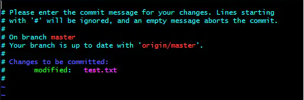
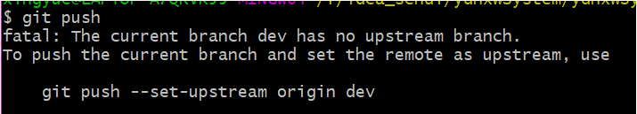
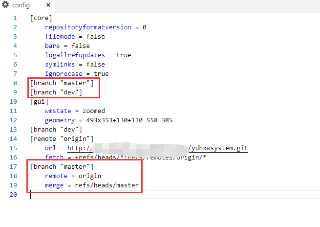

###问题1：git commit
git: git commit 提交时，提示Please enter the commit message for your changes......如何解决？



```bash
 Please enter the commit message for your changes. Lines starting

 with '#' will be ignored, and an empty message aborts the commit.


 On branch master

 Your branch is up to date with 'origin/master'.
```
提交git commit 时，没有输入说明导致

当前页面输入 :wq ，回车即可退出该页面
**注意：** 冒号+wq（wq要小写）

退出后重新提交，git commit -m 后面添加上代码提交说明即可

git commit -m "代码提交说明"---代码提交说明可以任意写(最好代码说明有意义，方便日后查询)

###问题2：git push时提示--set-upstream
问题：

提示需要加--set-upstream

**分析：**
git分支与远程主机存在对应分支，可能是单个可能是多个。 

simple方式：如果当前分支只有一个追踪分支，那么git push origin到主机时，可以省略主机名。 

matching方式：如果当前分支与多个主机存在追踪关系，那么git push --set-upstream origin master（省略形式为：git push -u origin master）将本地的master分支推送到origin主机（--set-upstream选项会指定一个默认主机），同时指定该主机为默认主机，后面使用可以不加任何参数使用git push。

**注意：**
Git 2.0版本之前，默认采用matching方法，现在改为默认采用simple方式。
 
**原因：**
1.可能是因为当前版本小于2.0
2.若不是版本问题则是因为当前分支与多个主机存在对应关系，而当前未指定对应关系
此时检查一下项目下.git的.config文件中是否缺少该分支指定信息

**解决：**
1.按照提示在命令行中输入git push --set-upstream origin dev
2.修改配置文件增加dev相关配置（复制红框2，修改master为dev）