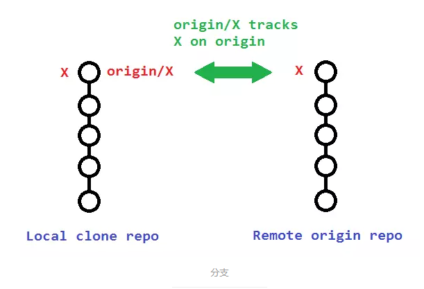
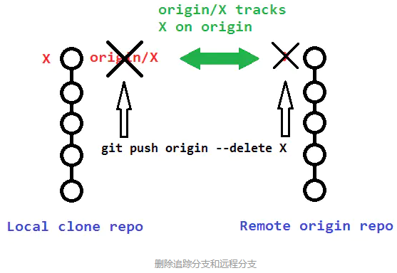
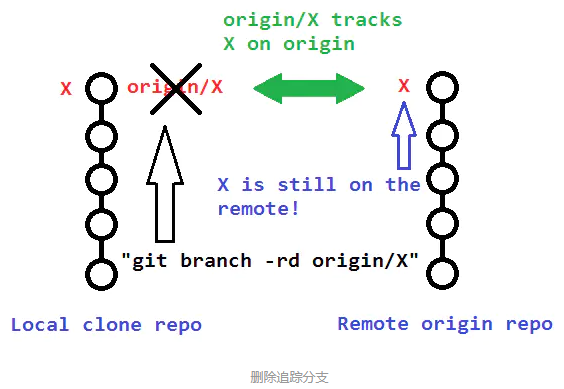

###git 分支开发

* **新建分支**
```bash
git branch zbmenu
```

* **切换到新建的分支**
```bash
git checkout zbmenu
```
git branch可以看到已经在zbmenu分支上

* **更新分支代码并提交**
```bash
git add *

git commit -m "init zbmenu"

git push --set-upstream origin zbmenu
```
* **合并分支代码**
```bash
如：将zbmenu分支代码合并到master分支

先切换到master分支

git checkout master

merge代码，保证主分支代码最新

git merge zbmenu

push到远端仓库

git push
```
- **git 删除分支**

&emsp;&emsp; 当一个分支被废弃时,我们要做的是删除分支,在彻底删除一个分支时,需要三个步骤
&emsp;&emsp;1.删除本地分支
&emsp;&emsp;2.删除远程分支
&emsp;&emsp;3.删除本地追踪分支,即追踪远程master的追踪分支origin/master


- *删除本地分支*
  在删除分支的时候,我们会使用git branch --delete dev来执行，缩写git branch -d dev，另有git branch -D dev
  **区别：**
  ```
  - -d是--delete的缩写,在使用--delete删除分支时,该分支必须完全和它的上游分支merge完成(了解上游分支,可以点击查看链接),如果没有上游分支,必须要和HEAD完全merge
    <br>
  - -D是--delete --force的缩写,这样写可以在不检查merge状态的情况下删除分支
    <br>
  - --force简写-f,作用是将当前branch重置到初始点(startpoint),如果不使用--force的话,git分支无法修改一个已经存在的分支.
    <br>
    ```
- *删除远程分支*
指令git push origin --delete branch,该指令也会删除追踪分支


    <br>
- *删除追踪分支*
通过指令git branch --delete --remotes \<remote>/\<branch>,可以删除追踪分支,该操作并没有真正删除远程分支,而是删除的本地分支和远程分支的关联关系,即追踪分支


如上,通过命令行git push origin --delete branch会删除远程分支和追踪分支,不需要单独删除追踪分支,但是如果通过网页对远程分支进行删除,追踪分支是不会被删除的.

```
**注：** 在git版本1.6.6之后,可以通过git fetch origin --prune或它的简写git fetch origin -p来单独删除追踪分支

**补充:**
git fetch的--all和--multiple用来获取多个资源
git --prune用来删除被废弃的追踪分支,该指令可以实现git remote update和git remote prune的功能,使得git remote update和git remote prune没有太多存在的必要,尽管如此,目前git并没有删除这两个指令的打算.
```
