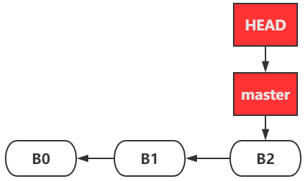
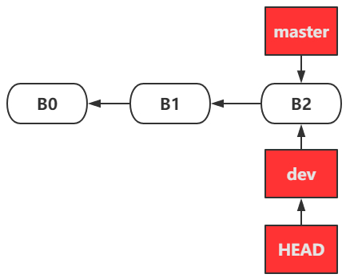
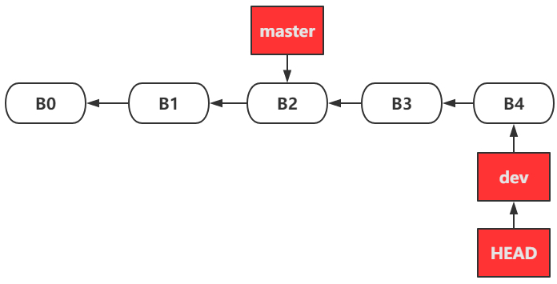
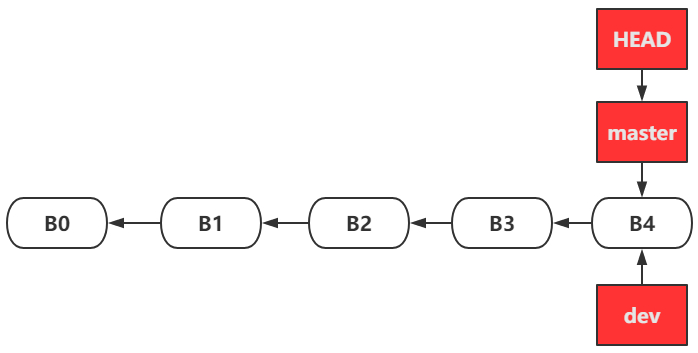
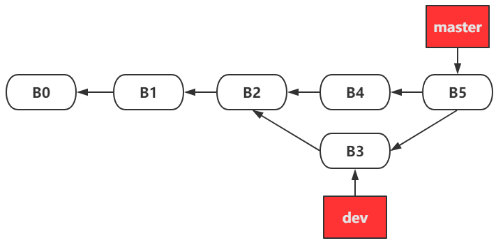

###git 分支开发

* **新建分支**
```bash
git branch zbmenu
```

* **切换到新建的分支**
```bash
git checkout zbmenu
```
git branch可以看到已经在zbmenu分支上

* **更新分支代码并提交**
```bash
git add *

git commit -m "init zbmenu"

git push --set-upstream origin zbmenu
```


* **合并分支代码**
```bash
如：将zbmenu分支代码合并到master分支

先切换到master分支

git checkout master

merge代码，保证主分支代码最新

git merge zbmenu

push到远端仓库

git push
```
- **git 删除分支**

&emsp;&emsp; 当一个分支被废弃时,我们要做的是删除分支,在彻底删除一个分支时,需要三个步骤
&emsp;&emsp;1.删除本地分支
&emsp;&emsp;2.删除远程分支
&emsp;&emsp;3.删除本地追踪分支,即追踪远程master的追踪分支origin/master


- *删除本地分支*
  在删除分支的时候,我们会使用git branch --delete dev来执行，缩写git branch -d dev，另有git branch -D dev
  **区别：**
  ```
  - -d是--delete的缩写,在使用--delete删除分支时,该分支必须完全和它的上游分支merge完成(了解上游分支,可以点击查看链接),如果没有上游分支,必须要和HEAD完全merge
    <br>
  - -D是--delete --force的缩写,这样写可以在不检查merge状态的情况下删除分支
    <br>
  - --force简写-f,作用是将当前branch重置到初始点(startpoint),如果不使用--force的话,git分支无法修改一个已经存在的分支.
    <br>
    ```
- *删除远程分支*
指令git push origin --delete branch,该指令也会删除追踪分支


    <br>
- *删除追踪分支*
通过指令git branch --delete --remotes \<remote>/\<branch>,可以删除追踪分支,该操作并没有真正删除远程分支,而是删除的本地分支和远程分支的关联关系,即追踪分支


如上,通过命令行git push origin --delete branch会删除远程分支和追踪分支,不需要单独删除追踪分支,但是如果通过网页对远程分支进行删除,追踪分支是不会被删除的.

```
**注：** 在git版本1.6.6之后,可以通过git fetch origin --prune或它的简写git fetch origin -p来单独删除追踪分支

**补充:**
git fetch的--all和--multiple用来获取多个资源
git --prune用来删除被废弃的追踪分支,该指令可以实现git remote update和git remote prune的功能,使得git remote update和git remote prune没有太多存在的必要,尽管如此,目前git并没有删除这两个指令的打算.
```

###Git：合并分支----git merge命令应用的三种情景

####一、git merge 命令应用的三种情景

#####1.1 “快进”(无冲突)

- **master分支**
假设现在只有一个默认的 master 分支，并提交了3次，B0、B1和B2都是提交对象。


&emsp;&emsp;首先要清楚，每次产生的提交对象会包含一个指向上次提交对象（父对象）的指针，所以图中B0、B1和B2之间的箭头是指针指向父对象的意思，真正的提交顺序还是B0到B1再到B2。同时 master 指针指向最新的提交B2。

&emsp;&emsp;另外Git中还有一个名为 HEAD 的特殊指针，它是一个指针，指向当前所在的本地分支（可以将 HEAD想象为当前分支的别名）
- **dev新分支**

现在新建一个分支并切换到新分支
```bash
$ git checkout -b dev
Switched to a new branch 'dev'
```
它是下面两条命令的简写：
```bash
$ git branch dev
$ git checkout dev
```

**分析：** 因为是在B2创建 dev，所以新分支 dev 指向B2。另外从分支 master 切换到分支 dev，所以HEAD指向当前分支 dev

在 dev 分支工作并提交了2次：


- **合并dev和master**

在分支 dev 的工作结束，切换到分支 master ，然后把 dev 合并到 master 上：
```bash
$ git checkout master
Switched to branch 'master'
$ git merge dev
Merge made by the 'recursive' strategy.
 test-2.txt | 3 ++-
 1 file changed, 2 insertions(+), 1 deletion(-)
```

由于当前 master 分支所指向的提交是你当前提交（dev的提交）的直接上游，所以 Git 只是简单的将 master 指针向前移动。 换句话说，当你试图合并两个分支时，如果顺着一个分支走下去能够到达另一个分支，那么 Git 在合并两者的时候，只会简单的将指针向前推进（指针右移），因为这种情况下的合并操作没有需要解决的分歧——这就叫做 “**快进（fast-forward）**”。合并结果如下：



**最后**，你可以删除 dev 分支，因为你已经不再需要它了 —— master 分支已经指向了同一个位置。 你可以使用带 -d 选项的 git branch 命令来删除分支：

```bash
$ git branch -d dev
```

#####1.2 非“快进”，修改不同文件。(无冲突)
当在新分支 dev 进行了一次提交B3，再回到分支 master 又进行一次提交 B4：


这里用 git merge 合并分为两种情况，现在讲**第一种**情况：

&emsp;&emsp;**修改内容分析：** 在 master 分支和 dev 分支的公共祖先 B2 后，master 和 dev 的提交是对不同文件或者同一文件的不同部分进行了修改，Git 可以合并它们。（比如说原来有 test-1 和 test-2 两个文件，B4修改的是 test-1 文件，而B3修改的是 test-2 文件，然后合并两个分支。）
```bash
$ git checkout master
Switched to branch 'master'
$ git merge dev
Merge made by the 'recursive' strategy.
 test-2.txt | 3 ++-
 1 file changed, 2 insertions(+), 1 deletion(-)
```
**合并是成功的**

**tips：** 出现这种情况的时候，Git 会使用两个分支的末端所指的快照（B3 和 B4）以及这两个分支的公共祖先（B2），做一个简单的三方合并。注意这里合并后 master 自动 commit 提交了一次，产生了提交B5。而B5中的结果是三方合并的结果。合并结果如下：


**最后**，合并完成，你已经不再需要dev分支了。 现在你可以删除这个分支
```bash
$ git branch -d dev
```
<br>
#####1.3 非“快进”，修改相同文件。(有冲突)
当在新分支 dev 进行了一次提交B3，再回到分支 master 又进行一次提交 B4


上面讲的是第一种情况，现在讲**第二种**情况：
&emsp;&emsp;**修改内容分析：** 在 master 分支和 dev 分支的公共祖先 B2 后，master 和 dev 的提交是对同一个文件的同一个部分进行了不同的修改，Git 就没法干净的合并它们。（比如说原来有 test-1 和 test-2 两个文件，B4修改的是 test-1 文件，而B3修改的也是 test-1 文件的同一部分，然后合并两个分支。）

```bash
$ git checkout master
Switched to branch 'master'
$ git merge dev
Auto-merging test-1.txt
CONFLICT (content): Merge conflict in test-1.txt
Automatic merge failed; fix conflicts and then commit the result.
```
**合并是失败的**

&emsp;&emsp;此时 Git 做了合并，但是没有自动地创建一个新的合并提交。 Git 会暂停下来，等待你去解决合并产生的冲突。 你可以在合并冲突后的任意时刻使用 git status 命令来查看那些因包含合并冲突而处于未合并（unmerged）状态的文件：
```bash
$ git status
On branch master
You have unmerged paths.
  (fix conflicts and run "git commit")
  (use "git merge --abort" to abort the merge)

Unmerged paths:
  (use "git add <file>..." to mark resolution)

        both modified:   test-1.txt

no changes added to commit (use "git add" and/or "git commit -a")
```
&emsp;&emsp;任何因包含合并冲突而有待解决的文件，都会以未合并状态标识出来。 Git 会在有冲突的文件中加入标准的冲突解决标记，这样你可以打开这些包含冲突的文件然后手动解决冲突。 出现冲突的文件会包含一些特殊区段，看起来像下面这个样子：
```bash
This is test-1.
update test-1.
add test-1.
<<<<<<< HEAD
test master.
=======
test dev.
>>>>>>> dev
```
&emsp;&emsp;这里 HEAD 表示所指示的版本（也就是你的 master 分支所在的位置，因为你在运行 merge 命令的时候已经检出到了这个分支）在这个区段的上半部分（======= 的上半部分），而 dev 分支所指示的版本在 ======= 的下半部分。 为了解决冲突，你必须选择使用由 ======= 分割的两部分中的一个，或者你也可以自行合并这些内容。 例如，你可以通过把这段内容换成下面的样子来解决冲突：
```bash
This is test-1.
update test-1.
add test-1.
test master.
test dev.
```
然后手动提交：
```bash
$ git add .
$ git commit -m "connection"
[master f7daa6b] connection
```
然后冲突就解决了。合并结果如下：


**最后**，合并完成，你已经不再需要dev分支了。 现在你可以删除这个分支
```bash
$ git branch -d dev
```