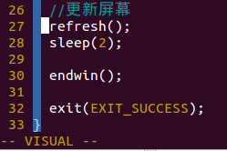
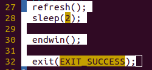
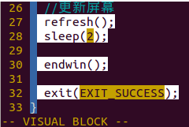
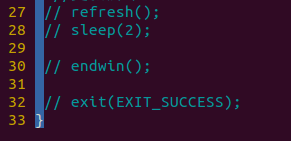
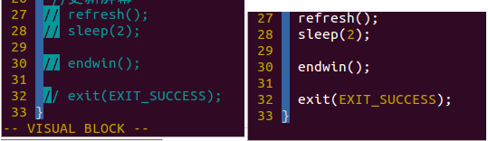
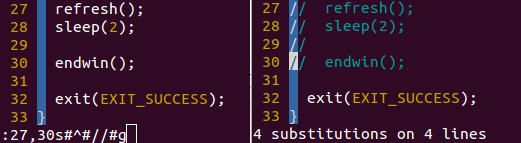
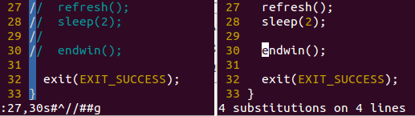

###linux 命令学习
- **ctrl+z:** 将任务中止（暂停的意思）,但是此任务并没有结束,他仍然在进程中他只是维持挂起的状态,用户可以使用**fg/bg**操作继续前台或后台的任务,**fg**命令**重新启动**前台被中断的任务,**bg**命令把被**中断的任务放在
后台执行**
 
**例如:** 当你vi一个文件是,如果需要用shell执行别的操作,但是你又不打算关闭vi,因为你得存盘推出,你可以简单的按下ctrl+z,shell会将vi进程挂起~,当你结束了那个shell操作之后,你可以用fg命令继续vi你的文件。
 
- **ctrl+c:** 
    - 强制中断程序的执行,,进程已经终止;
    - 比较暴力，就是发送Terminal到当前的程序，比如你正在运行一个查找功能，文件正在查找中，Ctrl+C就会强制结束当前的这个进程。
 
- **ctrl+d:** 
    - 不是发送信号，而是表示一个特殊的二进制值，表示 EOF;
    - 是发送一个exit信号，没有那么强烈，类似ctrl+C的操作，比如你从管理员root退回到你的普通用户就可以这么用
**注：**在shell中，ctrl-d表示推出当前shell.

####Linux 的 vim 编辑器中的翻页命令
- **整页翻页命令为：** 
    - Ctrl + f 键   f 的英文全拼为：forward；
    - Ctrl + b 键  b 的英文全拼为：backWord；
- **翻半页命令为：** 
    - Ctrl + d 键  d 的英文全拼为：down；
    - Ctrl + u 键  u 的英文全拼为：up；
- **直接查看该脚本的最后一行：**
    - 输入:$，然后回车；
    - 在键盘按下大写G ；
    - 在键盘按Shift + g；
- **直接查看该脚本的第一行：**
    - 输入:0或:1，然后回车；
    - 在键盘按下小写gg；

h  左，或 Backspace 或方向键
j  下，或 Enter 或 +（要 Shift 键），或方向键
k  上，或 方向键或 -（不必 Shift 键）
l  右，或 Space 或方向键

#### Linux 如何在 vim 里搜索关键字
**例如:** 搜索 the写法：/the     +回车
- /+关键字 ，回车即可。此为从文档当前位置向下查找关键字，按n键查找关键字下一个位置；
- ?+关键字，回车即可。此为从文档挡圈位置向上查找关键字，按n键向上查找关键字；

#### Linux 之 vim中选中多行、复制和粘贴
**一、选中多行：**
&emsp;&emsp;使用命令vim打开文件，移动光标至所选行的开头，按v进入视图，键盘上按向下键，选中所需行即可。
**二、复制与粘贴**
- **三种方法：**
    - 1）在上文第一部分的基础上，按y，然后移动光标至所需粘贴处，按p即可
    - 2）移动光标至所选行的开头，在命令模式下，输入nyy即可，n为从当前行开始，你所要复制的行数
    - 3）用鼠标选中想复制的内容，按下ctrl+insert复制，然后，shit+insert粘贴

####Linux 之 Vim编辑器-批量注释与反注释
**方法一 块选择模式**
- **插入注释：**
    - 用v进入virtual模式
    
    - 用上下键选中需要注释的行数
    
    - 按Control+v（win下面ctrl+q）进入列模式
    
    - 按大写“I”进入插入模式，输入注释符“#”或者是"//"，然后立刻按下ESC（两下）
    
- **取消注释：**
    - Ctrl + v 进入块选择模式，选中你要删除的行首的注释符号，注意// 要选中两个，选好之后按d即可删除注释
    

**方法二 替换命令**
- **批量注释：**
    - 使用下面命令在指定的行首添加注释：
    **:起始行号,结束行号s/^/注释符/g**
 
- **取消注释：**
    - **:起始行号,结束行号s/^注释符//g**
 
- **实例演示：**
    - **在27 - 30行添加 // 注释**
    :27,30s#^#//#g
    
    - **在27 - 30行删除 // 注释**
    :27,30s#^//##g
    

    - **在10 - 20行添加 # 注释**
    :10,20s/^/#/g
    - **在10 - 20行删除 # 注释**
    :10,20s/^/#//g
    **注意:** 例子中正则的分割符使用的是相反的符号，如果匹配// 那么使用 #作分隔符这样不需要对/作转义处理，节省输入次数。