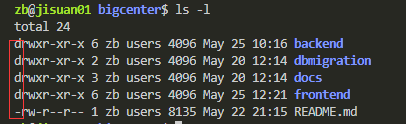
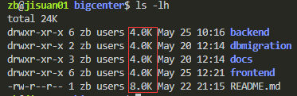

### 目录结构：
- **Bin：** 全称binary，含义是二进制、该目录中存储的都是一些二进制文件，文件都是可以被运行的。

- **Dev：** 该目录中主要存放的是外界设备，例如U盘、其他的光盘等。其中的外接设备是不能被直接使用的，需要挂载（类似windows下的分配盘符）。

- **ETC：** 该目录主要存储一些配置文件。

- **Home：** 表示"家"，表示**除了root用户以外其他用户的家目录**，类似于windows下的 User/用户目录。

- **Proc：** process,表示进程，该目录中存储的是Linux运行时候的进程。

- **Root:** 该目录是root用户自己的家目录。

- **Sbin：** 全称super binary，该目录也是存储一些可以被执行的二进制文件，但必须得有super权限的用户才能执行。

- **Tmp：** 表示“临时”的，当系统运行时候产生的临时文件会在这个目录存着。

- **Usr：** 存放的是用户自己安装的软件，类似于windows下的program files。

- **Var：** 存放的程序/系统的日志文件的目录

- **Mnt：** 当外接设备需要挂载的时候，就需要挂载到mnt目录下。

### Linux 的基本指令
- **一、指令与选项**
什么是Linux的指令？
指在Linux终端（命令行）中输入的内容就称之为指令
 
一个完成的指令的标准格式：Linux通用的格式
- **\#指令主体  [选项]  [操作对象]**
    - 一个指令可以包含多个选项
    - 操作对象也可以是多个
 
- **二、基础指令**
    - **用法1：#ls**
含义：列出当前工作目录下的所有文件/文件夹名称
 
    - **用法2：#ls 路径**
含义：列出制定路径下的所有文件/文件夹的名称
**关于路径（重要）：**
路径可以分为两种：相对路径、绝对路径
相对路径：相对首先得有一个参照物（一般就是当前的工作路径）
'./'【表示当前目录下】
'../'【表示上一级目录下】
绝对路径：不需要参照物，直接从跟'/'开始寻找对应的路径
 
    - **用法3：#ls 选项 路径**
含义：列出制定路径下的文件/文件夹的名称，并以制定的格式进行显示。
        - **常见语法：**
        1、#ls -l 路径
        2、#ls -la 路径
        选项解释：
        -l：表示list，表示以详细列表的形式进行展示
        -a：表示显示所有的文件/文件夹（包含了隐藏文件/文件夹）
        上诉列表中的第一列字符表示文档的类型，**其中 “-” 表示该行对应的文档类型为文件，“d” 表示文档类型为文件夹**
    - **用法4：#ls -lh 路径**
含义：列出制定路径下的所有文件/文件夹名称，以列表的形式并且在显示文档大小的时候以可读性较高的形式显示。
        