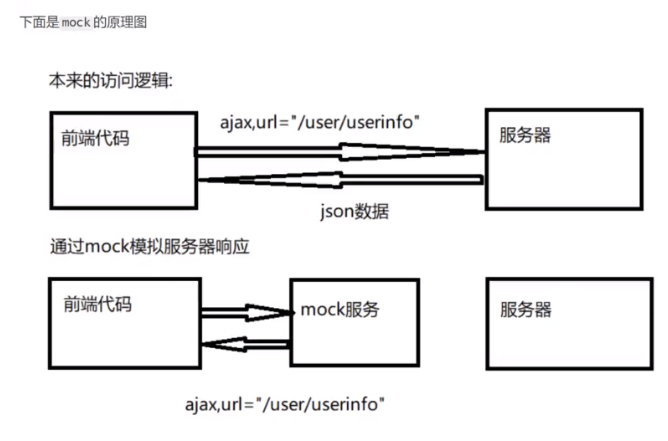
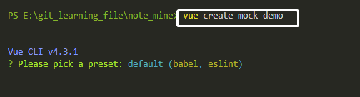
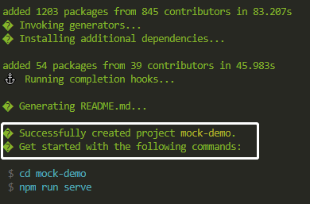
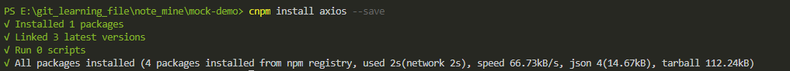
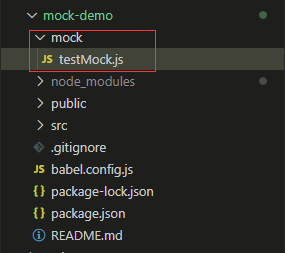
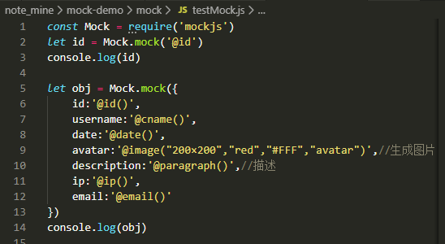
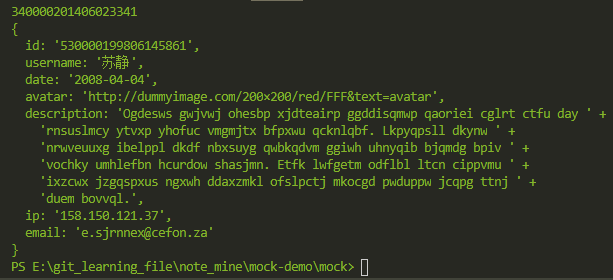
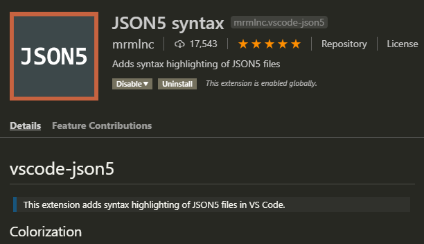

##步骤1、搭建测试项目
__mock Learning地址：http://mockjs.com/__
mock原理：


###1.1 创建项目
```javascript
vue create mock-demo
```


*****
###1.2 安装依赖

* *使用 axios 发送 ajax*
```javascript
cnpm install axios --save
```


* *使用 mockjs 产生随机数据*
```javascript
cnpm install mockjs --save-dev
```
* *使用 json5解决 json文件，无法添加注释问题*
```javascript
cnpm install json5 --save-dev
```
##步骤2. 学习mockjs

创建mock文件，test，及运行结果


运行代码
```javascript
const Mock = require('mockjs')
let id = Mock.mock('@id')
console.log(id)

let obj = Mock.mock({
    id:'@id()',
    username:'@cname()',
    date:'@date()',
    avatar:'@image("200×200","red","#FFF","avatar")',//生成图片
    description:'@paragraph()',//描述
    ip:'@ip()',
    email:'@email()'
})
console.log(obj)
```


**打印输出结果**


##步骤3. 学习json5
###3.1 编辑器安装json5扩展


###3.2 引入json5库来解析json5格式

在mock文件夹下，新建testJSON5.js
```javascript
const fs = require('fs')
const path = require('path')
const JSON5 = require('json5')

//读取json文件
function getJSONFile(filepath){
    //读取指定json文件
    var json = fs.readFileSync(path.resolve(__dirname,filepath),'utf-8');
    return JSON5.parse(json)
}

var json = getJSONFile('./userinfo.json5');

console.log('json',json)
```

##步骤4. mock和vue-cli结合

###4.1 新建index.js
```javascript
const fs = require('fs');
const path = require('path');
const Mock = require('mockjs');//mockjs 导入依赖模块
const JSON5 = require('json5');

//读取json文件
function getJSONFile(filepath){
    //读取指定json文件
    var json = fs.readFileSync(path.resolve(__dirname,filepath),'utf-8');
    //解析并返回
    return JSON5.parse(json)
}

//返回一个函数
module.exports = function(app){
    //监听http请求
    app.get('/user/userinfo',function(rep,res){
        //每次响应请求时读取mock data的json文件
        //getJSONFile 方法定义了如何读取json文件并解析成数据对象
        var json = getJSONFile('./userinfo.json5');
        //将json传入Mock.mock方法中，生成的数据返回给浏览器
        res.json(Mock.mock(json));
    });
}

```
###步骤4.2 新建vue.config.js
[参考-webpack](https://cli.vuejs.org/zh/config/#devserver)
[参考-devServer](https://cli.vuejs.org/zh/config/#css-loaderoptions)
[参考-devServer配置说明](https://webpack.js.org/configuration/dev-server/#devserverbefore)
在项目根目录下，新建vue.config.js
```javascript
module.exports = {
    devServer:{
        before:require('./mock/index.js')//引入mock/index.js
    }
}
```
###步骤4.3 发送ajax请求
在src/components/HelloWorld.vue中发送ajax请求
```javascript
//首先引入第三方库axios
import axios from 'axios'
export default {
  name: 'HelloWorld',
  props: {
    msg: String
  },
  //挂载生命周期函数
  mounted:function(){
    axios.get('/user/userinfo')
    .then(res=>{
      console.log(res)
    })
    .catch(err=>{
      console.error(err);
    })
  }
}
```
###当后端开发好后如何移除mock
