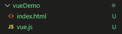

<!-- TOC -->

- [序言 vue.js 介绍](#序言-vuejs-介绍)
- [第1节 安装与部署](#第1节-安装与部署)
    - [vueify介绍](#vueify介绍)
    - [开发版本](#开发版本)
- [第2节 创建第一个vue应用](#第2节-创建第一个vue应用)
- [第3节 数据与方法](#第3节-数据与方法)
- [第4节 生命周期](#第4节-生命周期)
- [第5节 模板语法-插值](#第5节-模板语法-插值)
- [第6节 模板语法-指令](#第6节-模板语法-指令)
- [第7节 class与style绑定](#第7节-class与style绑定)
- [第8节 条件渲染](#第8节-条件渲染)
- [第9节 列表渲染](#第9节-列表渲染)
- [第10节 事件绑定](#第10节-事件绑定)
- [第11节 表单输入绑定](#第11节-表单输入绑定)
- [第12节 组件基础](#第12节-组件基础)
- [第13节 组件注册](#第13节-组件注册)
- [第14节 单文件组件](#第14节-单文件组件)
- [第15节 免终端开发vue应用](#第15节-免终端开发vue应用)

<!-- /TOC -->

###序言 vue.js 介绍

vue.js 渐进式 Javascript 框架

- **1. vue.js 优点**
    - **体积小**：压缩后 33k
    - **更高的运行效率：** 基于虚拟dom，一种可以预先通过JavaScript进行各种计算，把最终的DOM操作计算出来并优化的技术，由于这个DOM操作属于预处理操作，并没有真实的操作DOM，所以叫做虚拟DOM
    - **双向数据绑定：** 让开发者不用再去操作dom对象，更多精力投入到业务逻辑上
    - **生态丰富、学习成本低：** 市场上拥有大量成熟、稳定的基于vue.js的ui框架、常用组建，拿来即可实现快速开发；对初学者友好、入门容易

###第1节 安装与部署

创建基本页面：

**index.html 文件内容:**
**<font size=3>vue引入方式 1：直接用 \<script> 引入</font>**
```javascript
<!DOCTYPE html>
<html lang="en">
<head>
    <meta charset="UTF-8">
    <meta name="viewport" content="width=device-width, initial-scale=1.0">
    <title>Document</title>
    // 直接使用<script>引入
    <script src="vue.js" type="text/javascript" charset="utf-8"></script>
</head>
<body>
    
</body>
</html>
```
**<font size=3>vue引入方式 2：CDN</font>**
```html
// 制作原型或学习，可以使用最新的版本
<script src="https://cdn.jsdelivr.net/npm/vue/dist/vue.js"></script>
```
```html
// 生产环境，推荐 明确的版本号和构建文件，以避免新版本造成的不可预期的破坏
<script src="https://cdn.jsdelivr.net/npm/vue@2.6.11"></script>
```
```html
// 使用原生 ES Modules，这里也有一个兼容 ES Module 的构建文件
<script type="module">
  import Vue from 'https://cdn.jsdelivr.net/npm/vue@2.6.11/dist/vue.esm.browser.js'
</script>
```

**<font size=3>vue引入方式 3：NPM</font>**
&emsp;&emsp;在用 Vue 构建大型应用时推荐使用 NPM 安装[1]。NPM 能很好地和诸如 webpack 或 Browserify 模块打包器配合使用。同时 Vue 也提供配套工具来开发单文件组件。

```bash
# 最新稳定版
$ npm install vue
```
**命令行工具 (CLI)**
&emsp;&emsp;Vue 提供了一个[官方的 CLI](https://github.com/vuejs/vue-cli)，为单页面应用 (SPA) 快速搭建繁杂的脚手架。它为现代前端工作流提供了 batteries-included 的构建设置。只需要几分钟的时间就可以运行起来并带有热重载、保存时 lint 校验，以及生产环境可用的构建版本。更多详情可查阅 [Vue CLI 的文档](https://cli.vuejs.org)。

在 NPM 包的 dist/ 目录你将会找到很多不同的 Vue.js 构建版本。这里列出了它们之间的差别：

| |UMD|CommonJS|ES Module (基于构建工具使用) | ES Module (直接用于浏览器)|
|----|----|----|----|----|
|完整版|	vue.js|	vue.common.js|	vue.esm.js|	vue.esm.browser.js|
|只包含运行时版	|vue.runtime.js|	vue.runtime.common.js	|vue.runtime.esm.js	|-|
|完整版 (生产环境)	|vue.min.js	|-	|-	|vue.esm.browser.min.js|
|只包含运行时版 (生产环境)|	vue.runtime.min.js|	-|	-	|-|


**术语**
- 完整版：同时包含编译器和运行时的版本。

- 编译器：用来将模板字符串编译成为 JavaScript 渲染函数的代码。

- 运行时：用来创建 Vue 实例、渲染并处理虚拟 DOM 等的代码。基本上就是除去编译器的其它一切。

- UMD：UMD 版本可以通过 \<script> 标签直接用在浏览器中。jsDelivr CDN 的 https://cdn.jsdelivr.net/npm/vue 默认文件就是运行时 + 编译器的 UMD 版本 (vue.js)。

- CommonJS：CommonJS 版本用来配合老的打包工具比如 Browserify 或 webpack 1。这些打包工具的默认文件 (pkg.main) 是只包含运行时的 CommonJS 版本 (vue.runtime.common.js)。

- ES Module：从 2.6 开始 Vue 会提供两个 ES Modules (ESM) 构建文件：

    - 为打包工具提供的 ESM：为诸如 webpack 2 或 Rollup 提供的现代打包工具。ESM 格式被设计为可以被静态分析，所以打包工具可以利用这一点来进行“tree-shaking”并将用不到的代码排除出最终的包。为这些打包工具提供的默认文件 (pkg.module) 是只有运行时的 ES Module 构建 (vue.runtime.esm.js)。

    - 为浏览器提供的 ESM (2.6+)：用于在现代浏览器中通过 \<script type="module"> 直接导入。

**运行时 + 编译器 vs. 只包含运行时**

如果你需要在客户端编译模板 (比如传入一个字符串给 template 选项，或挂载到一个元素上并以其 DOM 内部的 HTML 作为模板)，就将需要加上编译器，即完整版：
```javascript
// 需要编译器
new Vue({
  template: '<div>{{ hi }}</div>'
})

// 不需要编译器
new Vue({
  render (h) {
    return h('div', this.hi)
  }
})
```
**注意：**
&emsp;&emsp;当使用 vue-loader 或 vueify 的时候，*.vue 文件内部的模板会在构建时预编译成 JavaScript。你在最终打好的包里实际上是不需要编译器的，所以只用运行时版本即可

- **vue-loader 是什么**
    - 简单的说，他就是基于webpack的一个的loader，解析和转换 .vue 文件，提取出其中的逻辑代码 script、样式代码 style、以及 HTML 模版 template，再分别把它们交给对应的 Loader 去处理，核心的作用，就是提取，划重点
    - 什么是webpack的loader，其实就是用来打包、转译js或者css文件，简单的说就是把你写的代码转换成浏览器能识别的，还有一些打包、压缩的功能等

**vue文件式例 折叠源码**

```html
<template>
  <div class="example">{{ msg }}</div>
</template>
 
<script>
export default {
  data () {
    return {
      msg: 'Hello world!'
    }
  }
}
</script>
 
<style>
.example {
  color: red;
}
</style>
```
- **vue-loader 的作用**

    - 允许为 Vue 组件的每个部分使用其它的 webpack loader，例如在 \<style> 的部分使用 Sass 和在 \<template> 的部分使用 Pug；
    - 允许在一个 .vue 文件中使用自定义块，并对其运用自定义的 loader 链；
    - 使用 webpack loader 将 \<style> 和 \<template> 中引用的资源当作模块依赖来处理；
    - 为每个组件模拟出 scoped CSS；
    - 在开发过程中使用热重载来保持状态。

- **vue-loader的实现**

&emsp;&emsp;先找到了vue-laoder在node_modules中的目录，由于源码中有很多对代码压缩、热重载之类的代码，我们定一个方向，看看一个.vue文件在运行时，是被vue-loader怎样处理的

&emsp;&emsp;既然vue-loader的核心首先是将以为.vue为结尾的组件进行分析、提取和转换，那么首先我们要找到以下几个loader
1. selector–将.vue文件解析拆分成一个parts对象，其中分别包含style、- script、template
2. style-compiler–解析style部分
3. template-compiler 解析template部分
4. babel-loader-- 解析script部分，并转换为浏览器能识别的普通js
&emsp;&emsp;首先在loader.js这个总入口中，我们不关心其他的，先关心这几个加载的loader，从名字判断这事解析css、template的关键

####vueify介绍

所谓vueify，就是使用.vue格式的文件定义组件，一个.vue文件就是一个组件。

在.vue文件定义的组件内容包括3部分：

- \<style>\</style>标签：定义组件样式
- \<template>\</template>标签：定义组件模板
- \<script>\</script>标签：定义组件的各种选项，比如data, methods等。
vue.js已经拥抱ES6了，使用.vue文件定义组件时，需要使用ES6的一些语法，ES6提供了一些较为优秀的特性，这使得定义组件的代码变得更加简洁。

以下app.vue文件定义了一个组件：

```html
// app.vue
<style>
  .red {
    color: #f00;
  }
</style>

<template>
  <h1 class="red">{{msg}}</h1>
</template>

<script>
export default {
  data () {
    return {
      msg: 'Hello world!'
    }
  }
}
</script>
```

你也可以在组件文件中使用预处理语言：

```html
// app.vue
<style lang="stylus">
.red
  color #f00
</style>

<template lang="jade">
h1(class="red") {{msg}}
</template>

<script lang="coffee">
module.exports =
  data: ->
    msg: 'Hello world!'
</script>
```

因为运行时版本相比完整版体积要小大约 30%，所以应该尽可能使用这个版本。如果你仍然希望使用完整版，则需要在打包工具里配置一个别名：
**webpack**
```javascript
module.exports = {
  // ...
  resolve: {
    alias: {
      'vue$': 'vue/dist/vue.esm.js' // 用 webpack 1 时需用 'vue/dist/vue.common.js'
    }
  }
}
```
**Rollup**
```javascript
const alias = require('rollup-plugin-alias')

rollup({
  // ...
  plugins: [
    alias({
      'vue': require.resolve('vue/dist/vue.esm.js')
    })
  ]
})
```

**Browserify**
添加到你项目的 package.json：
```javascript
{
  // ...
  "browser": {
    "vue": "vue/dist/vue.common.js"
  }
}
```

**Parcel**

在你项目的 package.json 中添加：

```javascript
{
  // ...
  "alias": {
    "vue" : "./node_modules/vue/dist/vue.common.js"
  }
}
```

**开发环境 vs. 生产环境模式**

- 对于 UMD 版本来说，开发环境/生产环境模式是硬编码好的：开发环境下用未压缩的代码，生产环境下使用压缩后的代码。
<br>
- CommonJS 和 ES Module 版本是用于打包工具的，因此我们不提供压缩后的版本。你需要自行将最终的包进行压缩。
<br>
- CommonJS 和 ES Module 版本同时保留原始的 process.env.NODE_ENV 检测，以决定它们应该运行在什么模式下。你应该使用适当的打包工具配置来替换这些环境变量以便控制 Vue 所运行的模式。把 process.env.NODE_ENV 替换为字符串字面量同时可以让 UglifyJS 之类的压缩工具完全丢掉仅供开发环境的代码块，以减少最终的文件尺寸。


**webpack**
在 webpack 4+ 中，你可以使用 mode 选项：

```javascript
module.exports = {
  mode: 'production'
}
```

但是在 webpack 3 及其更低版本中，你需要使用 DefinePlugin：

```javascript
var webpack = require('webpack')

module.exports = {
  // ...
  plugins: [
    // ...
    new webpack.DefinePlugin({
      'process.env': {
        NODE_ENV: JSON.stringify('production')
      }
    })
  ]
}
```

**Rollup**

使用 rollup-plugin-replace：
```javascript
const replace = require('rollup-plugin-replace')

rollup({
  // ...
  plugins: [
    replace({
      'process.env.NODE_ENV': JSON.stringify('production')
    })
  ]
}).then(...)
```

**Browserify**

为你的包应用一次全局的 envify 转换

```bash
NODE_ENV=production browserify -g envify -e main.js | uglifyjs -c -m > build.js
```
也可以移步生产环境部署

**CSP 环境**
有些环境，如 Google Chrome Apps，会强制应用内容安全策略 (CSP)，不能使用 new Function() 对表达式求值。这时可以用 CSP 兼容版本。完整版本依赖于该功能来编译模板，所以无法在这些环境下使用。

另一方面，运行时版本则是完全兼容 CSP 的。当通过 [webpack + vue-loader](https://github.com/vuejs-templates/webpack-simple) 或者 [Browserify + vueify](https://github.com/vuejs-templates/browserify-simple) 构建时，模板将被预编译为 render 函数，可以在 CSP 环境中完美运行

####开发版本
**重要：** GitHub 仓库的 /dist 文件夹只有在新版本发布时才会提交。如果想要使用 GitHub 上 Vue 最新的源码，你需要自己构建
```shell
git clone https://github.com/vuejs/vue.git node_modules/vue
cd node_modules/vue
npm install
npm run build
```
**Bower**

Bower 只提供 UMD 版本
```sheel
# 最新稳定版本
$ bower install vue
```
**AMD 模块加载器**
所有 UMD 版本都可以直接用作 AMD 模块

###第2节 创建第一个vue应用

###第3节 数据与方法

###第4节 生命周期

###第5节 模板语法-插值

###第6节 模板语法-指令

###第7节 class与style绑定

###第8节 条件渲染

###第9节 列表渲染

###第10节 事件绑定

###第11节 表单输入绑定

###第12节 组件基础

###第13节 组件注册

###第14节 单文件组件

###第15节 免终端开发vue应用