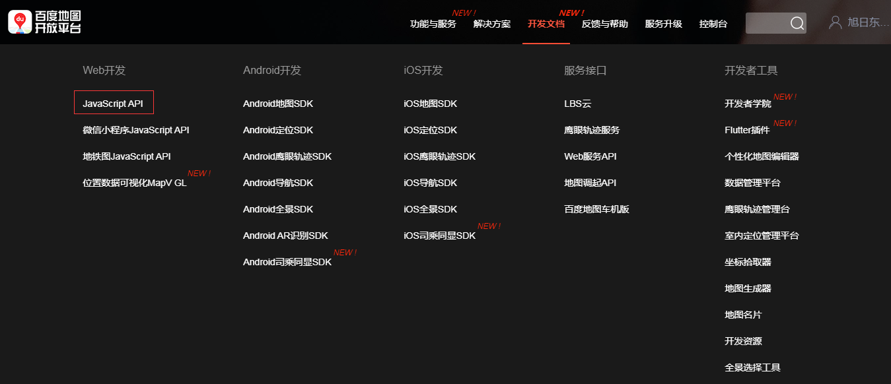
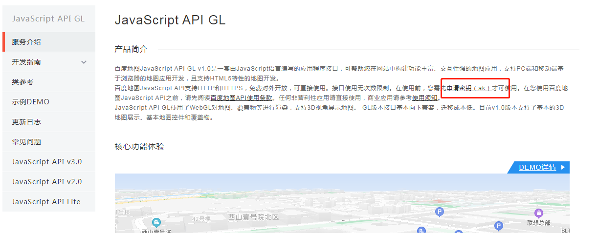
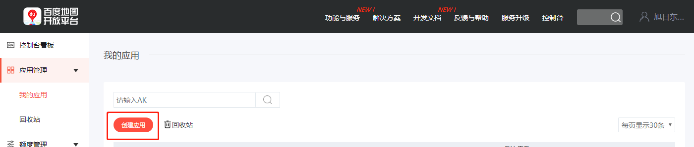
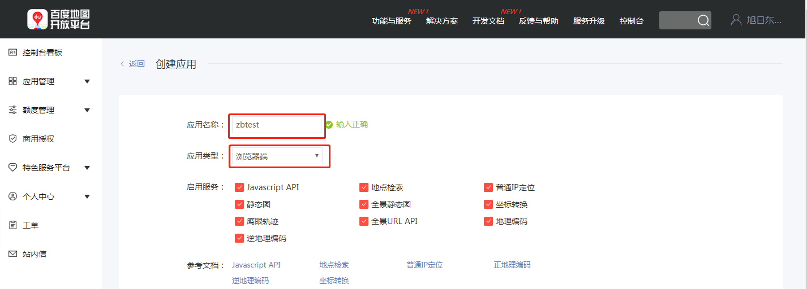
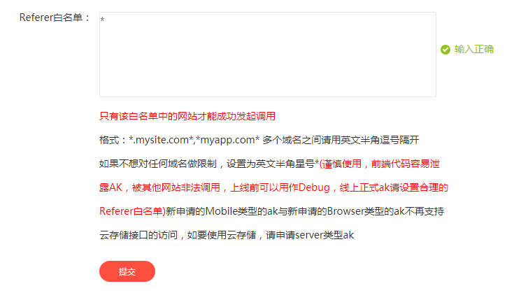
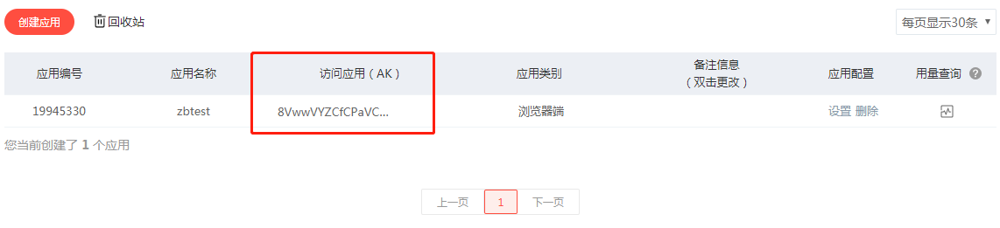

###ak密钥申请
链接：http://lbsyun.baidu.com/

直接通过这个链接也可以：http://lbsyun.baidu.com/apiconsole/key?application=key#/home

- **第一步 创建应用**

 
- **第二步 设置参数**
**填写应用名称、应用类型:**

设置白名单，只有白名单里面的域名才可以访问，debug时可以任意设置，不限制。
**特别注意：** 生产环境需要合理考虑设置

- **第三步 获取密钥**

